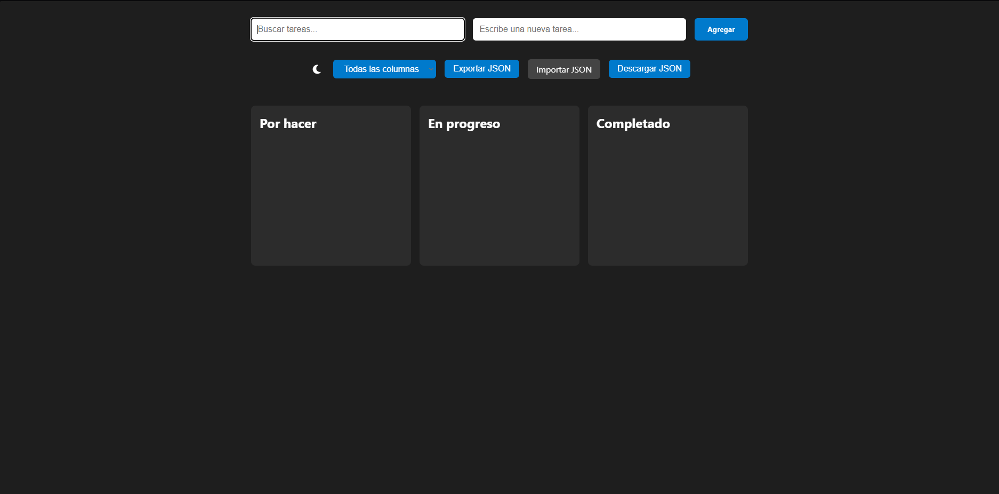

# 🧮 kanban-simple

**Tablero Kanban interactivo desarrollado con HTML, CSS y JavaScript puro**, que permite organizar tareas visualmente entre columnas mediante funcionalidad de arrastrar y soltar (_drag and drop_).

Este proyecto hace parte del portafolio de aprendizaje de [Up Develop](https://updevelop.co) y busca fortalecer habilidades fundamentales de desarrollo web sin frameworks externos.

## 🌐 Demo en vivo

🔗 [https://sergiosilva-dev.github.io/kanban-simple/](https://sergiosilva-dev.github.io/kanban-simple/)

## Previsualización



## 🚀 Funcionalidades

- ✅ Interfaz tipo tablero Kanban (To Do / In Progress / Done)
- 🔄 Arrastrar y soltar tareas entre columnas
- ✏️ Editar tareas con doble clic + ALT
- 🗑️ Eliminar tareas con doble clic
- 💾 Guardado automático en localStorage
- 🔍 Búsqueda de tareas en todas las columnas
- 🧩 Filtro por columna (Todas / Por hacer / En progreso / Completado)
- 📤 Exportar e importar tareas en formato `.json`
- 🌗 Cambio de tema claro/oscuro con icono Font Awesome
- 🌐 SEO básico con meta etiquetas, favicon y manifest
- 📱 Diseño responsive adaptable a dispositivos móviles

## 🛠️ Tecnologías utilizadas

- HTML5
- CSS3 (custom properties para tema)
- JavaScript (Vanilla)
- Git + GitHub + GitHub Pages
- VS Code

## 📁 Estructura del proyecto

```bash
kanban-simple/
├── index.html
├── css/
│   └── style.css
├── js/
│   └── main.js
├── assets/
│   ├── icons/
│   └── img/
├── site.webmanifest
├── robots.txt
├── sitemap.xml
├── LICENSE
├── README.md
```

## 🌐 Cómo usar este proyecto

1. Clona el repositorio:

```bash
git clone https://github.com/sergiosilva-dev/kanban-simple.git
```

2. Abre `index.html` en tu navegador o usa la extensión **Live Server** de VS Code.

3. También puedes verlo en línea aquí:  
   🔗 [https://sergiosilva-dev.github.io/kanban-simple/](https://sergiosilva-dev.github.io/kanban-simple/)

## 👨‍💻 Autor

**Sergio Andres Silva Martinez**  
Cofundador de [Up Develop](https://updevelop.co)

- [GitHub](https://github.com/sergiosilva-dev)
- [LinkedIn](https://www.linkedin.com/in/sergiosilva-dev)
- [Página web](https://updevelop.co)

## 📄 Licencia

Este proyecto está bajo la licencia MIT. Revisa el archivo [LICENSE](LICENSE) para más detalles.
